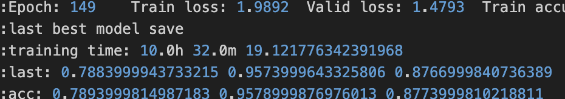
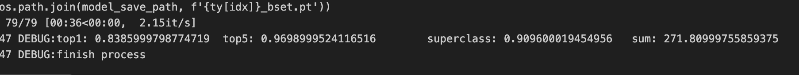

# 24-2 시각지능학습 코드 통합


# How to Conduct a Peer Review for This Project

The final submission code file is **[sub.ipynb](./sub.ipynb)**.


## 1. Clone the repository

```shell
git clone https://github.com/hy-vision-learning/jck-vision-int.git
```

## 2. Move to jck-vision-init

```shell
cd ./jck-vision-init
```

## 3. Install Required Libraries

All required packages can be installed via requirements.txt.

```shell
pip install -r requirements.txt
```

## 4. Change the random seed

Open the [change_randomseed.py](./change_randomseed.py) file and change the random seed.

## 	5. Run the code

We are ensembling WideResNet, PyramidNet, and DenseNet. Therefore, a total of four runs are required.

Please train the models by running [ensemble-pyramidnet.ipynb](./ensemble-pyramidnet.ipynb), [ensemble-densenet.ipynb](./ensemble-densenet.ipynb), and [ensemble-wideresnet.ipynb](./ensemble-wideresnet.ipynb) one at a time. Once all the training is complete, run [ensemble-final.ipynb](./ensemble-final.ipynb) to output the final results.

## 6.	Check the Results

The training time for each model will be displayed immediately after the training is completed.  

  

  

The final training results will be output in the final file.  




## main.py 사용법

argument 출력
```shell
python3 main.py --help
```
출력
```
-h, --help            show this help message and exit
-rs RANDOM_SEED, --random_seed RANDOM_SEED
                    학습 랜덤 시드. -1은 랜덤 시드를 고정하지 않음.
-lf LOG_FILE, --log_file LOG_FILE
                    로그 파일 출력 여부. 0=false, 1=true
-m {custom,resnet18,resnet34,resnet50,resnet101,resnet152,resnext50,wide_resnet_16_4,wide_resnet_28_10_03}, --model {custom,resnet18,resnet34,resnet50,resnet101,resnet152,resnext50,wide_resnet_16_4,wide_resnet_28_10_03}
                    학습 모델
-op {sgd,adam}, --optimizer {sgd,adam}
                    옵티마이저
-ls {none,lambda_lr,step_lr,cos_annealing,custom_annealing,one_cycle,cycle}, --lr_scheduler {none,lambda_lr,step_lr,cos_annealing,custom_annealing,one_cycle,cycle}
                    lr 스케쥴러
-ds SPLIT_RATIO, --split_ratio SPLIT_RATIO
                    train/validation 분할 비율
-w NUM_WORKER, --num_worker NUM_WORKER
                    train/validation 분할 비율
-b BATCH_SIZE, --batch_size BATCH_SIZE
                    학습 배치사이즈
-e EPOCH, --epoch EPOCH
                    epoch
-lr LEARNING_RATE, --learning_rate LEARNING_RATE
                    optimizer learning rate 설정
-wd WEIGHT_DECAY, --weight_decay WEIGHT_DECAY
                    optimizer weight decay 설정
-gc GRADIENT_CLIP, --gradient_clip GRADIENT_CLIP
                    gradient clip 설정. -1은 비활성화
-es EARLY_STOPPING, --early_stopping EARLY_STOPPING
                    ealry stoppin epoch 지정. -1은 비활성화
```
